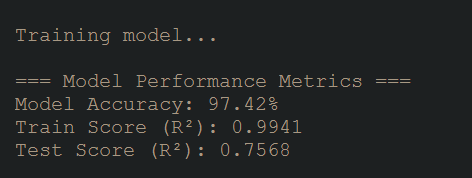
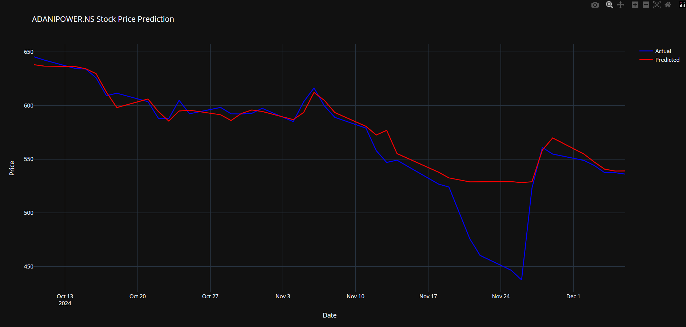
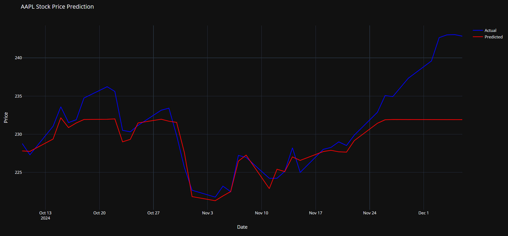

<h1 align="center" id="title">Stock Movement Analysis Based on Social Media Sentiment</h1>

<p id="description">A sophisticated machine learning system that predicts stock price movements by analyzing sentiment and technical indicators. The project combines data from Reddit, news sources, and market data to provide comprehensive stock predictions using advanced sentiment analysis and machine learning techniques.</p>

<p align="center">


</p>

<h2>🧐 Features</h2>

Here're some of the project's best features:

* Multi-source Data Integration: Combines Reddit posts, news articles, and stock market data
* Advanced Sentiment Analysis: Analyzes social media sentiment using TextBlob
* Technical Analysis: Calculates various technical indicators (SMA, RSI, MACD, Bollinger Bands)
* Machine Learning Prediction: Uses Random Forest for price prediction
* Interactive Visualizations: Plotly-based charts for predictions and accuracy
* Real-time Data: Fetches current market data using yfinance
* Comprehensive Error Handling: Robust error management for API calls

<h2>💻 Built with</h2>

Technologies used in the project:

* Python: Core programming language
* PRAW: Reddit API wrapper
* NewsAPI: News data collection
* yfinance: Yahoo Finance market data
* TextBlob: Sentiment analysis
* scikit-learn: Machine learning implementation
* Plotly: Interactive visualizations
* pandas: Data manipulation

  <h2> Model Accuracy</h2>

  <p>Attended a Accuracy <b>97.42%</b> </p>

  

  
<h2>📈 Visualization Example</h2>

The code generates interactive Plotly charts showing:
- Actual vs Predicted stock prices
- Accuracy metrics over time
- Technical indicators

<h2>ADANI POWER</h2>
<p>Adani Stocks was full of Ups and Down, due to recent allegations, My model  very closely predicted that too </p>



<h2> APPLE</h2>
<p> Apple being a very stable stock</p>



<h2>🔍 Code Explanation</h2>

1. **Initialization**: 
   - Create StockPredictor instance with desired stock symbol
   - Can be used with any valid stock ticker (e.g., MSFT, GOOGL, TSLA)

2. **Data Collection**:
   - Fetches historical stock data using yfinance
   - Collects sentiment data from Reddit and news sources
   - Combines multiple data sources for comprehensive analysis

3. **Model Training**:
   - Prepares features including technical indicators and sentiment metrics
   - Trains Random Forest model on historical data
   - Generates predictions and calculates accuracy metrics

4. **Results**:
   - Provides detailed accuracy metrics
   - Generates interactive visualizations
   - Shows both numerical and graphical results

<h2>⚠️ Requirements</h2>

Ensure you have:
- All required API keys in your .env file
- Installed all dependencies from requirements.txt
- Sufficient historical data available for your chosen stock

<h2>💡 Tips</h2>

- Use longer time periods for more accurate predictions
- Adjust the sentiment analysis period as needed
- Monitor API rate limits when fetching data
- Consider market

<h2>🛠️ Installation Steps:</h2>

<p>1. Clone the repository:</p>

```
git clone https://github.com/yourusername/stock-sentiment-analysis.git
```
<p>2. Create and activate virtual environment:</p>

```
python -m venv venv
venv\Scripts\activate # Windows
```
```
source venv/bin/activate # Linux/Mac
```

<p>3. Install required dependencies:</p>

```
pip install -r requirements.txt
```

<p>4. Set up environment variables:</p>

- Create a .env file with:

- NEWS_API_KEY=your_news_api_key
- REDDIT_CLIENT_ID=your_reddit_client_id
- REDDIT_CLIENT_SECRET=your_reddit_client_secret

<p>5. Run the application:</p>

```
python main.py
```

<h2>📊 Output Examples</h2>

The system provides:

* Stock price predictions
* Accuracy metrics:
  - Mean Accuracy
  - Directional Accuracy
  - Threshold Accuracy
* Interactive plots showing:
  - Actual vs Predicted prices
  - Accuracy over time
  - Technical indicators

<h2>🔒 Error Handling</h2>

* API connection validation
* Data availability checking
* Sentiment analysis validation
* Model performance monitoring
* Comprehensive error logging

<h2>📝 Usage Example</h2>


<h2>🚧 Future Roadmap</h2>

* Implement deep learning models
* Add more social media sources
* Real-time prediction updates
* Portfolio optimization features
* Enhanced visualization options
* Automated trading integration

<h2>🛡️ License:</h2>

This project is licensed under the MIT License

<h2>💖Like my work?</h2>

This project needs a ⭐️ from you. Don't forget to leave a star ⭐️

<h2>🙏 Acknowledgments</h2>

* Reddit API for social media data
* NewsAPI for news data
* Yahoo Finance for market data
* Python community for excellent libraries

Developed with ❤️ by Abhash Goyal
<p>https://www.linkedin.com/in/abhashgoyal-4692b91b8/</p>
<p>abhashgoyal200@gmail.com</p>


